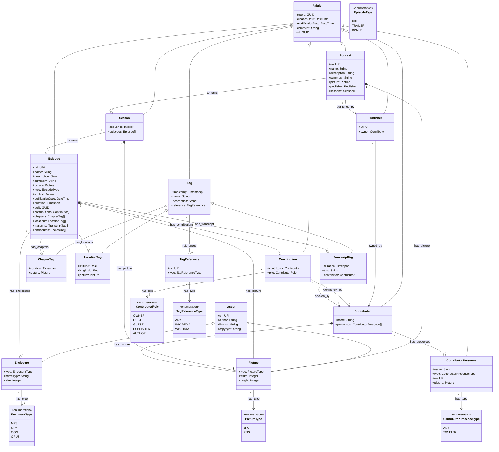

# P3 Model Library

A C++ object model library for podcast production and publishing (P3) workflows, providing comprehensive modeling capabilities for the entire podcast ecosystem.

## Overview

The P3 Model Library is designed to model the complete podcast production and publishing domain, from content creation to distribution. It provides a robust foundation for building podcast-related applications with modern C++ standards and best practices.

## Features

### Complete C++ Object Model (22 Classes)
- **Content Hierarchy**: Podcast → Season → Episode with full relationship management
- **Contributor System**: People, roles, and online presence management
- **Tag System**: Chapter markers, location tags, and transcript integration
- **Asset Management**: Picture and enclosure handling for media files
- **Publishing Workflow**: Publisher entities with ownership tracking
- **Annotation Framework**: Timestamped content annotation with external references
- **Enumeration System**: 6 comprehensive enums for type safety and validation

### Domain-Specific Models
- **Content Models**: Complete podcast content hierarchy with metadata
- **Production Models**: Contributor roles, presence tracking, and contribution management
- **Publishing Models**: Publisher entities with URI and ownership management
- **Metadata Models**: Tag system with Wikipedia/Wikidata integration
- **Asset Models**: Type-safe media file management (images, audio, video)
- **Workflow Models**: Chapter organization, location tracking, transcript management
- **Runtime Utilities**: GUID, String, TimeSpan, TimeStamp foundation classes

## UML Architecture Diagram

The following UML diagram visualizes the complete object model structure and relationships:



## Requirements

### Minimum Requirements

- CMake 4.0 or higher
- C++23 compatible compiler (tested with AppleClang 17.0.0)
- Ninja build system (recommended)

### Optional Dependencies (for documentation)

- Doxygen (API documentation generation)
- LaTeX distribution (PDF documentation)
- Graphviz dot (dependency graphs and UML diagrams)

## Quick Start

### Building the Library

```bash
# Clone the repository
git clone https://github.com/ultralove/p3-model.git
cd p3-model

# Configure with CMake using Ninja generator
cmake -G Ninja -B _build

# Build the static library
cmake --build _build
```

The build generates `_build/libp3-model.a` static library ready for integration.

### Building Documentation

```bash
# Generate LaTeX documentation (requires Doxygen)
cmake --build _build --target docs

# Build PDF from LaTeX (requires LaTeX distribution)
cmake --build _build --target docs-pdf

# PDF output location: _build/docs/latex/p3-model.pdf
```

### Integration Example

```cpp
#include "model.h"

int main() {
    // Initialize the P3 Model library
    if (!ultralove::p3::model::Model::Initialize()) {
        return 1;
    }

    // Get library information
    auto version = ultralove::p3::model::Model::GetVersion();
    auto name = ultralove::p3::model::Model::GetLibraryName();

    // Your podcast application logic here

    // Cleanup
    ultralove::p3::model::Model::Shutdown();
    return 0;
}
```

## Implementation Status

### Current Version: 0.1.0

The P3 Model Library includes a complete C++ object model implementation with 22 classes organized in a hierarchical structure:

#### Core Components ✅
- **Base Infrastructure**: Fabric base class providing common entity functionality
- **Content Hierarchy**: Podcast → Season → Episode relationship management
- **Contributor System**: People, roles, and online presence tracking
- **Publishing Workflow**: Publisher entities with ownership and URI management
- **Tag System**: Timestamped content annotation (chapters, locations, transcripts)
- **Asset Management**: Type-safe media file handling (pictures, enclosures)
- **Enumeration Framework**: 6 comprehensive enums for type safety

#### Usage Example

```cpp
#include "model.h"
using namespace ultralove::p3::model;

int main() {
    // Create a publisher (value-based)
    Publisher publisher("https://example.com");

    // Create a podcast with embedded publisher
    Podcast podcast("https://example.com/podcast", "My Podcast", publisher);

    // Create a season with episodes
    Season season1(1);
    Episode episode1("https://example.com/ep1", "Episode 1",
                    EpisodeType::FULL, runtime::Timespan{});

    // Add content relationships (value-based)
    season1.AddEpisode(episode1);
    podcast.AddSeason(season1);

    // Add media assets (no pointers)
    Picture artwork(PictureType::JPG);
    Enclosure audioFile(EnclosureType::MP3, 15728640);

    episode1.SetPicture(artwork);
    episode1.AddEnclosure(audioFile);

    return 0;
}
```

#### Runtime Dependencies
The struct implementations currently use placeholder runtime classes:
- `runtime::String`: Basic placeholder (will be enhanced)
- `runtime::GUID`: Basic 128-bit structure (will be enhanced)
- `runtime::Timestamp`: Basic placeholder (will be enhanced)
- `runtime::Timespan`: Basic placeholder (will be enhanced)

## Architecture

### Individual File Structure
Each struct is implemented in its own header file following the `model[name].h` naming convention:

**Core Foundation**:
- `modelfabric.h` - Base struct with common identifiers
- `modelasset.h` - Media file base class

**Content Hierarchy**:
- `modelpodcast.h` - Top-level show container
- `modelseason.h` - Season grouping
- `modelepisode.h` - Individual episode

**Media Assets**:
- `modelpicture.h` - Image asset implementation
- `modelenclosure.h` - Audio/video asset implementation

**People & Organizations**:
- `modelcontributor.h` - Person/organization details
- `modelcontributorpresence.h` - Contributor participation tracking
- `modelcontribution.h` - Specific contribution details
- `modelpublisher.h` - Publishing organization

**Tagging System**:
- `modeltag.h` - Basic tag implementation
- `modeltagreference.h` - Tag reference with metadata
- `modelchaptertag.h` - Chapter marking
- `modellocationtag.h` - Geographic tagging
- `modeltranscripttag.h` - Transcript synchronization

### 100% Value Semantics
The library achieves complete value semantics with **zero pointer fields**:
- Publisher references are embedded as values
- Picture assets are stored as values (not pointers)
- Tag relationships use value composition for type safety
- Author attribution uses strings for clean dependency separation

### Zero Circular Dependencies
Clean include chains through individual file architecture eliminate all circular dependencies, enabling:
- Simplified memory management
- Clear ownership semantics
- Improved compile times
- Better testability

## Detailed Implementation Guide

### Core Base Classes

#### Fabric - Universal Base Entity
```cpp
// File: modelfabric.h
struct Fabric {
    runtime::GUID GetId() const;
    runtime::String GetComment() const;
    void SetComment(const runtime::String& comment);
    // Creation/modification timestamps, type identification
};
```

**Purpose**: Foundation for all domain entities
**Features**: Unique identification, audit trail, type safety
**Used By**: All podcast domain objects inherit from Fabric

### Content Hierarchy

#### Podcast - Top-Level Container
```cpp
// File: modelpodcast.h
struct Podcast : public Fabric {
    runtime::String GetUri() const;
    runtime::String GetName() const;
    runtime::String GetDescription() const;
    Publisher GetPublisher() const;
    Picture GetPicture() const;
    std::vector<Season> GetSeasons() const;
};
```

**Purpose**: Main podcast show container
**Features**: Metadata management, season collection, publisher relationship
**Key Design**: Publisher embedded as value (not pointer)

#### Season - Episode Grouping
```cpp
// File: modelseason.h
struct Season : public Fabric {
    int GetSequence() const;
    std::vector<Episode> GetEpisodes() const;
    Picture GetPicture() const;
};
```

**Purpose**: Logical grouping of episodes
**Features**: Sequential ordering, episode collection, artwork

#### Episode - Individual Content Unit
```cpp
// File: modelepisode.h
struct Episode : public Fabric {
    runtime::String GetUri() const;
    EpisodeType GetType() const;
    runtime::Timespan GetDuration() const;
    std::vector<ChapterTag> GetChapters() const;
    std::vector<Enclosure> GetEnclosures() const;
    std::vector<Contribution> GetContributions() const;
};
```

**Purpose**: Individual podcast episode
**Features**: Rich metadata, chapter support, multi-format enclosures, contributor tracking

### People and Organizations

#### Contributor - Person/Organization Details
```cpp
// File: modelcontributor.h
struct Contributor : public Fabric {
    runtime::String GetName() const;
    Picture GetImage() const;
    std::vector<ContributorPresence> GetPresences() const;
};
```

**Purpose**: People and organizations in podcast production
**Features**: Identity management, online presence tracking, profile images
**Key Design**: Picture stored as value for clean ownership

#### Publisher - Publishing Organization
```cpp
// File: modelpublisher.h
struct Publisher : public Fabric {
    runtime::String GetUri() const;
    Contributor GetOwner() const;
};
```

**Purpose**: Publishing entity management
**Features**: URI identification, ownership tracking
**Key Design**: Owner stored as Contributor value (not pointer)

### Asset Management System

#### Asset - Media File Base
```cpp
// File: modelasset.h
struct Asset {
    runtime::String GetUri() const;
    runtime::String GetAuthor() const;
    // License, copyright, URI management
};
```

**Purpose**: Base for all digital media assets
**Features**: URI tracking, string-based author attribution, rights management
**Derived Classes**: Picture, Enclosure
**Key Change**: Author field converted from Contributor pointer to String for circular dependency elimination

#### Picture - Image Asset Implementation
```cpp
// File: modelpicture.h
struct Picture : public Asset {
    PictureType GetType() const;
    int GetWidth() const;
    int GetHeight() const;
};
```

**Purpose**: Image asset management
**Features**: Format support (JPG, PNG), dimension tracking, asset inheritance

### Tagging and Annotation System

#### Tag - Base Annotation Class
```cpp
// File: modeltag.h
struct Tag : public Fabric {
    runtime::Timestamp GetTimestamp() const;
    runtime::String GetName() const;
    TagReference GetReference() const;
};
```

**Purpose**: Base for all timestamped annotations
**Features**: Timeline positioning, external references, metadata
**Derived Classes**: ChapterTag, LocationTag, TranscriptTag

#### TagReference - External Reference Management
```cpp
// File: modeltagreference.h
struct TagReference {
    runtime::String GetUrl() const;
    TagReferenceType GetType() const;
    Tag GetTag() const;
};
```

**Purpose**: Links to external knowledge sources
**Features**: Wikipedia/Wikidata integration, type-safe references
**Key Design**: Embeds Tag as value for strong typing

### Implementation Status

#### Architectural Achievements ✅
- **Individual Files**: All 22 structs in separate `model[name].h` files
- **Value Semantics**: 100% pointer-free design with embedded relationships
- **Zero Dependencies**: Complete elimination of circular dependencies
- **Clean Build**: Compiles to `libp3-model.a` without warnings
- **Type Safety**: Strong typing through comprehensive enumerations
- **Documentation**: Full Doxygen integration with UML diagrams

#### Build Verification
```bash
# Clean compilation
cmake --build _build
# Output: [6/7] Linking CXX static library libp3-model.a

# No circular dependencies
# No pointer management required
# All relationships use value semantics
```

## Code Standards

The project follows strict C++ coding standards:

- **Language Standard**: C++23
- **Namespace**: All code in `ultralove::p3::model`
- **Naming Conventions**:
  - Types: Upper PascalCase (`Episode`, `SharedObject`)
  - Functions: Upper PascalCase (`GetTitle`, `SetDuration`)
  - Variables: camelCase (`bufferSize`, `episodeCount`)
  - Member variables: camelCase with underscore postfix (`title_`, `duration_`)
  - Constants: UPPER_SNAKE_CASE (`MAX_EPISODE_LENGTH`)
- **Memory Management**: RAII principles, smart pointers preferred
- **Documentation**: Doxygen-style comments with UML diagrams

## Project Structure

```text
p3-model/
├── CMakeLists.txt              # Main build configuration
├── version.in                  # Version management
├── model.h                     # Main library header
├── model.cpp                   # Main library implementation
├── modelfabric.h              # Base entity struct
├── modelasset.h               # Media file base struct
├── modelpicture.h             # Image asset struct
├── modelenclosure.h           # Audio/video asset struct
├── modelpodcast.h             # Top-level show struct
├── modelseason.h              # Season grouping struct
├── modelepisode.h             # Individual episode struct
├── modelcontributor.h         # Person/organization struct
├── modelcontributorpresence.h # Contributor presence struct
├── modelcontribution.h        # Contribution details struct
├── modelpublisher.h           # Publishing organization struct
├── modeltag.h                 # Base tag struct
├── modeltagreference.h        # Tag reference struct
├── modelchaptertag.h          # Chapter marking struct
├── modellocationtag.h         # Geographic tagging struct
├── modeltranscripttag.h       # Transcript synchronization struct
├── modelenumerations.h        # All enumeration types
├── runtime*.h                 # Runtime utility headers
├── cmake/                     # CMake package configuration
│   └── p3-model-config.cmake.in
├── docs/                      # Documentation resources
│   ├── plantuml-monochrome.puml  # PlantUML styling
│   └── plantuml-monochrome.css   # CSS styling
└── _build/                    # Build output directory (generated)
    ├── libp3-model.a          # Static library
    └── docs/                  # Generated documentation
```

## Version Management

Version information is managed through the `version.in` file. The current version is automatically read by CMake during the build process.

Current version: **0.1.0**

To update the version:

1. Edit the `version.in` file
2. Rebuild the project

## Contributing

We welcome contributions to the P3 Model Library. Please follow these guidelines:

1. **Code Style**: Follow the established coding standards outlined above
2. **Testing**: Write unit tests for new functionality
3. **Documentation**: Update documentation for API changes
4. **Commits**: Use conventional commit format (`type(scope): description`)
5. **Branches**: Use feature branches for development

### Commit Message Format

```text
type(scope): description

feat(core): add episode duration validation
fix(model): correct timestamp serialization
docs(api): update getting started guide
```

## Build System

The project uses modern CMake practices:

- Target-based configuration with `target_*` commands
- Ninja generator for optimal build performance
- Debug build type by default for development
- Comprehensive compiler warnings and standards compliance
- Automatic dependency management
- Package configuration for easy integration

## Documentation

The library includes comprehensive documentation:

- **API Documentation**: Generated with Doxygen
- **UML Diagrams**: Embedded PlantUML diagrams in headers
- **Architecture Diagrams**: Graphviz DOT for complex relationships
- **Integration Examples**: Practical usage patterns
- **Build Instructions**: Complete setup and build guide

## License

This project is licensed under the MIT License. See the [LICENSE](LICENSE) file for details.

## Support

For questions, issues, or contributions:

- **Issues**: Use GitHub Issues for bug reports and feature requests
- **Discussions**: Use GitHub Discussions for general questions
- **Documentation**: Refer to the generated API documentation

## Roadmap

The P3 Model Library is under active development. Planned features include:

- Complete podcast content modeling
- Production workflow automation
- Multi-platform publishing support
- Analytics and reporting capabilities
- Plugin architecture for extensibility
- Integration with popular podcast platforms

---

**P3 Model Library** - Building the future of podcast production technology.
