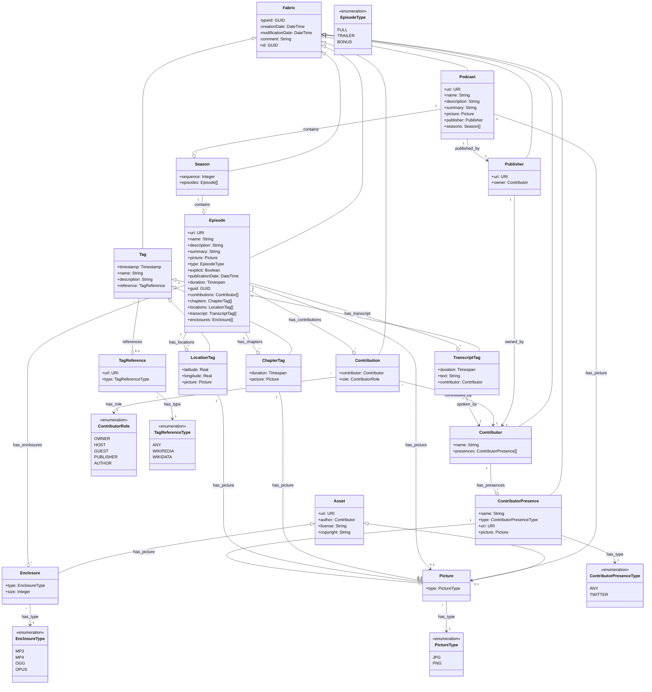

# P3 Model UML Diagram with Mermaid

This document contains UML diagrams created with Mermaid to visualize the p3-model library structure and relationships.

## Library Architecture Overview

```mermaid
classDiagram
    %% Base Fabric class
    class Fabric {
        -typeId: GUID
        -creationDate: DateTime
        -modificationDate: DateTime
        -comment: String
        +id: GUID
    }

    %% Main podcast entity
    class Podcast {
        +uri: URI
        +name: String
        +description: String
        +summary: String
        +picture: Picture
        +publisher: Publisher
        +seasons: Season[]
    }

    %% Season and Episode
    class Season {
        +sequence: Integer
        +episodes: Episode[]
    }

    class Episode {
        +uri: URI
        +name: String
        +description: String
        +summary: String
        +picture: Picture
        +type: EpisodeType
        +explicit: Boolean
        +publicationDate: DateTime
        +duration: Timespan
        +guid: GUID
        +contributions: Contributor[]
        +chapters: ChapterTag[]
        +locations: LocationTag[]
        +transcript: TranscriptTag[]
        +enclosures: Enclosure[]
    }

    %% Contributors
    class Contributor {
        +name: String
        +presences: ContributorPresence[]
    }

    class ContributorPresence {
        +name: String
        +type: ContributorPresenceType
        +uri: URI
        +picture: Picture
    }

    class Contribution {
        +contributor: Contributor
        +role: ContributorRole
    }

    %% Publisher
    class Publisher {
        +uri: URI
        +owner: Contributor
    }

    %% Tags
    class Tag {
        +timestamp: Timestamp
        +name: String
        +description: String
        +reference: TagReference
    }

    class ChapterTag {
        +duration: Timespan
        +picture: Picture
    }

    class LocationTag {
        +latitude: Real
        +longitude: Real
        +picture: Picture
    }

    class TranscriptTag {
        +duration: Timespan
        +text: String
        +contributor: Contributor
    }

    class TagReference {
        +url: URI
        +type: TagReferenceType
    }

    %% Assets and Media
    class Picture {
        +type: PictureType
    }

    class Asset {
        +uri: URI
        +author: Contributor
        +license: String
        +copyright: String
    }

    class Enclosure {
        +type: EnclosureType
        +size: Integer
    }

    %% Enumerations
    class ContributorRole {
        <<enumeration>>
        OWNER
        HOST
        GUEST
        PUBLISHER
        AUTHOR
    }

    class EpisodeType {
        <<enumeration>>
        FULL
        TRAILER
        BONUS
    }

    class ContributorPresenceType {
        <<enumeration>>
        ANY
        TWITTER
    }

    class TagReferenceType {
        <<enumeration>>
        ANY
        WIKIPEDIA
        WIKIDATA
    }

    class PictureType {
        <<enumeration>>
        JPG
        PNG
    }

    class EnclosureType {
        <<enumeration>>
        MP3
        MP4
        OGG
        OPUS
    }

    %% Relationships
    Fabric <|-- Podcast
    Fabric <|-- Season
    Fabric <|-- Episode
    Fabric <|-- Contributor
    Fabric <|-- ContributorPresence
    Fabric <|-- Contribution
    Fabric <|-- Publisher
    Fabric <|-- Tag

    Tag <|-- ChapterTag
    Tag <|-- LocationTag
    Tag <|-- TranscriptTag

    Asset <|-- Picture
    Asset <|-- Enclosure

    %% Associations
    Podcast "1" --o "*" Season : contains
    Season "1" --o "*" Episode : contains
    Podcast "1" --> "1" Publisher : published_by
    Publisher "1" --> "1" Contributor : owned_by

    Episode "1" --o "*" ChapterTag : has_chapters
    Episode "1" --o "*" LocationTag : has_locations
    Episode "1" --o "*" TranscriptTag : has_transcript
    Episode "1" --o "*" Enclosure : has_enclosures
    Episode "1" --o "*" Contribution : has_contributions

    Contribution "*" --> "1" Contributor : contributed_by
    Contribution "*" --> "1" ContributorRole : has_role

    Contributor "1" --o "*" ContributorPresence : has_presences
    ContributorPresence "*" --> "1" ContributorPresenceType : has_type

    Tag "*" --o "0..1" TagReference : references
    TagReference "*" --> "1" TagReferenceType : has_type

    TranscriptTag "*" --> "1" Contributor : spoken_by

    Picture "*" --> "1" PictureType : has_type
    Enclosure "*" --> "1" EnclosureType : has_type

    %% Picture associations
    Podcast "1" --> "0..1" Picture : has_picture
    Episode "1" --> "0..1" Picture : has_picture
    ChapterTag "1" --o "0..1" Picture : has_picture
    LocationTag "1" --o "0..1" Picture : has_picture
    ContributorPresence "1" --o "0..1" Picture : has_picture
```
